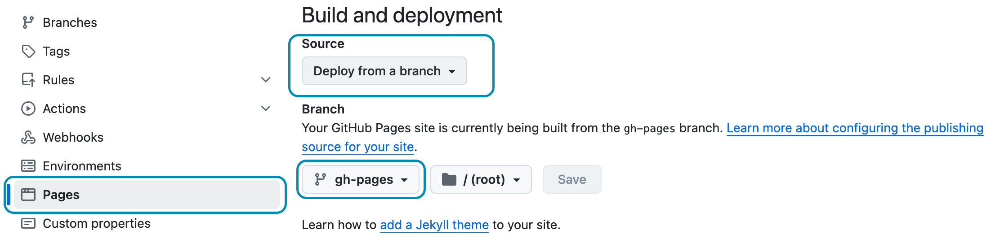

В этой главе показано, как подготовить ваш сайт Hydejack для сборки и развертывания в производственной среде на сторонних хостинг-провайдерах.

0. Этот неупорядоченный список начальных данных будет заменен на toc как неупорядоченный список
{:toc}

## Локальная сборка
При сборке Hydejack важно установить переменную среды `JEKYLL_ENV` в значение `production`.

В противном случае выходные данные не будут минифицированы. Сама сборка происходит с помощью команды `build` Jekyll.

~~~bash
$ JEKYLL_ENV=production bundle exec jekyll build
~~~

Это сгенерирует готовые статические файлы в `_site`,
которые можно развернуть, используя методы, описанные в [документации Jekyll][deploy].

## Локальная сборка с латентным семантическим анализом
По умолчанию, связанными записями отображаются только самые последние записи.
Hydejack немного изменяет это, показывая самые последние записи той же категории или тега.
Однако результаты по-прежнему довольно «не связаны».
Для получения лучших результатов Jekyll поддерживает [латентный семантический анализ][lsa] через [`classifier-reborn`][crb]
[Латентный семантический индексатор][lsi]

Чтобы использовать LSI, сначала необходимо отключить поведение Hydejack по умолчанию,
установив `use_lsi: true` в ключе `hydejack` в вашем файле конфигурации.

~~~yml
# file: `_config.yml`
hydejack:
  use_lsi: true
~~~

Затем надо запустить `jekyll build` с `--lsi` flag:

~~~bash
$ JEKYLL_ENV=production bundle exec jekyll build --lsi
~~~


Обратите внимание, что это может занять много времени.
После завершения сгенерированные статические файлы будут находиться в каталоге `_site`,
который можно развернуть, используя методы, описанные в [Документации Jekyll][deploy].

Затем необходимо запустить `jekyll build` с флагом `--lsi`:


## GitHub Pages

Начиная с сентября 2024 года, вы можете развертывать приложения на GitHub Pages, используя пользовательское действие GitHub Action.
Подробнее об этом можно прочитать в главе [Развертывание](deploy.md){:.heading.flip-title}.

{:.note}

Если вы используете стартовый набор на основе ветки `gh-pages` или папку `starter-kit-gh-pages` из **PRO-версии**,
все, что вам нужно сделать, это отправить свой репозиторий:

```bash
$ git add .
$ git commit "Update content"
$ git push origin gh-pages
```

Убедитесь, что в разделе «Страницы» настроек репозитория для параметра «Источник» установлено значение «Развертывать из ветки»,
и что ветка, в которую вы отправили изменения, совпадает с той, которая выбрана в раскрывающемся списке:


{:.border}

Убедитесь, что эти настройки установлены для продолжения использования устаревшего конвейера GitHub Pages.
{:.figcaption}

Продолжить [Deploy](deploy.md){:.heading.flip-title}
{:.read-more}


[deploy]: https://jekyllrb.com/docs/deployment-methods/
[lsa]: https://en.wikipedia.org/wiki/Latent_semantic_analysis
[crb]: http://www.classifier-reborn.com/
[lsi]: http://www.classifier-reborn.com/lsi

*[LSI]: Latent Semantic Indexer
