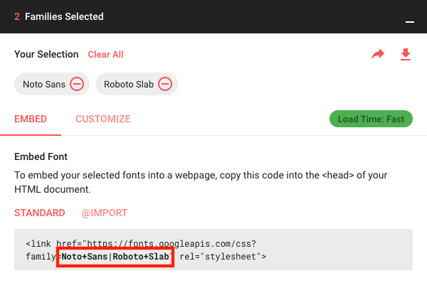

После запуска Jekyll вы можете начать с базовой настройки, добавив различные записи в `_config.yml`.
Помимо документации, представленной здесь, вы также можете прочитать [аннотированный файл конфигурации][config].

При внесении изменений в `_config.yml` необходимо перезапустить процесс Jekyll, чтобы изменения вступили в силу.

{:.note}

0. Этот неупорядоченный список начальных значений будет заменен на toc в качестве неупорядоченного списка
{:toc}

## Настройка `url` и `baseurl`
Первым делом следует установить правильные значения `url` и `baseurl` в `_config.yml`.

`url` — это домен вашего сайта, включая протокол (`http` или `https`). Для этого сайта это

~~~yml
# file: `_config.yml`
url: https://qwtel.com
~~~

После запуска Jekyll вы можете начать с базовой настройки, добавив различные записи в `_config.yml`.
Помимо документации здесь, вы также можете прочитать [аннотированный файл конфигурации][config].

При внесении изменений в `_config.yml` необходимо перезапустить процесс Jekyll, чтобы изменения вступили в силу.
Вам не нужно указывать это свойство при размещении на GitHub Pages или Netlify.

{:.note}

Если весь ваш блог Jekyll размещен в подкаталоге вашей страницы, укажите путь в `baseurl` с начальным `/`, но без конечного `/`,
например,

~~~yml
# file: `_config.yml`
baseurl: /hydejack
~~~

В противном случае укажите пустую строку `''`

Вам не нужно указывать это свойство при размещении на GitHub Pages или Netlify.

{:.note}

### GitHub Pages
### GitHub Pages
При размещении на [GitHub Pages](https://pages.github.com/) `url` будет `https://<username>.github.io`
(если вы не используете собственный домен).

`baseurl` зависит от типа размещаемой страницы.

* При размещении *страницы пользователя или организации* используйте пустую строку `''`.

* При размещении *страницы проекта* используйте `/<reponame>`.

Для получения информации о типах страниц, которые вы можете размещать на GitHub, см.

[Статью справки GitHub](https://help.github.com/articles/user-organization-and-project-pages/).

## Изменение акцентных цветов и изображений боковой панели
Hydejack позволяет выбрать фоновое изображение боковой панели, а также акцентный цвет
(цвет ссылок, контур выделения и фокусировки и т. д.).

~~~yml
# file: `_config.yml`
accent_image: /assets/img/sidebar-bg.jpg
accent_color: rgb(79,177,186)
~~~

Я рекомендую использовать размытое изображение, чтобы текст оставался читаемым.
Если вы сохраните размытое изображение в формате JPG, это также значительно уменьшит размер файла.

Свойство `accent_image` также принимает специальное значение `none`, которое удалит изображение по умолчанию.

Если изображение в боковой панели содержит яркие цвета, белый текст может быть трудночитаемым. В этом случае рассмотрите возможность установки
`invert_sidebar: true` в метаданных, чтобы инвертировать цвета текста в боковой панели.
Используйте [параметры по умолчанию метаданных][fmd], чтобы включить это на всех страницах (см. ниже).

Обратите внимание, что эти значения можно переопределить для каждой страницы отдельно, т.е. вы можете создать уникальный внешний вид для каждой страницы.
Вы также можете применить определенный внешний вид ко всем записям в категории с помощью [параметры по умолчанию метаданных][fmd], например:

```yml
# file: `_config.yml`
defaults:
  - scope:
      path:         hydejack/
    values:
      accent_image: /assets/img/hydejack-bg.jpg
      accent_color: rgb(38,139,210)
```

### Цвет темы
Hydejack также поддерживает свойство `theme_color`. Если оно установлено, оно изменит цвет фона боковой панели, а также установит свойство `theme_color` в [манифесте веб-приложения][wam]. В некоторых браузерах, например, в Chrome на Android, это изменит цвет компонентов пользовательского интерфейса браузера.

~~~yml
# file: `_config.yml`
theme_color:  rgb(25,55,71)
~~~

Подобно свойствам `accent_*`, цвет темы можно переопределить для каждой страницы отдельно, задав его в метаданных.

[wam]: https://web.dev/add-manifest/#theme-color

## Изменение шрифтов
Hydejack позволяет настраивать шрифт обычного текста и заголовков, а также имеет встроенную поддержку шрифтов Google Fonts.
В файле `_config.yml` с этим связаны три ключа: `font`, `font_heading` и `google_fonts`.
Значения по умолчанию:

~~~yml
# file: `_config.yml`
font:         Noto Sans, Helvetica, Arial, sans-serif
font_heading: Roboto Slab, Helvetica, Arial, sans-serif
google_fonts: Roboto+Slab:700|Noto+Sans:400,400i,700,700i
~~~

Значения `font` и `font_heading` должны быть допустимыми значениями CSS `font-family`. При использовании Google Fonts обязательно укажите хотя бы один запасной вариант.

Ключ `google_fonts` — это строка, необходимая для загрузки шрифтов из Google.
Вы можете получить его на странице загрузки на сайте [Google Fonts](https://fonts.google.com) после выбора одного или нескольких шрифтов:

{:width="600" height="398" loading="lazy"}


### Удаление шрифтов Google Fonts
Если вы предпочитаете не использовать шрифты Google Fonts и хотите удалить весь связанный с ними код с сайта,
установите значение ключа `google_fonts` равным `false`.

Параметр `no_google_fonts` был удален в версии 9 и больше не имеет никакого эффекта.

{:.note }

## Выбор макета блога
Hydejack предлагает три макета для отображения ваших записей в блоге.

* Макет [`list`][posts] отображает только заголовок и группирует записи по году публикации.

* Макет [`grid`][grid]\* доступен только в PRO-версии и отображает карточку контента (с `image`) для каждой записи.

* Макет [`blog`][blog] — это традиционный постраничный макет, отображающий заголовок и краткое содержание каждой записи.

[blog]: https://hydejack.com/blog/
[posts]: https://hydejack.com/posts/
[grid]: https://hydejack.com/blog/hydejack/

Для использования макета `list` или `grid` добавьте следующий метатег в новый файл Markdown:
~~~yml
---
layout: list # or `grid`
title:  Home
---
~~~

Если вы хотите использовать макет `blog`, вам необходимо добавить `jekyll-paginate` в ваш `Gemfile` и в список `plugins` в вашем конфигурационном файле:

```ruby
# file: `Gemfile`
gem "jekyll-paginate"
```

```yml
# file: `_config.yml`
plugins:
  - jekyll-paginate
```

Вам также необходимо добавить ключи `paginate` и `paginate_path` в ваш конфигурационный файл, например:

~~~yml
# file: `_config.yml`
paginate:      10
paginate_path: '/:num/'
~~~

Макет `blog` необходимо применить к файлу с расширением `.html`,
а параметр `paginate_path` должен соответствовать пути к файлу `index.html`.

Чтобы соответствовать указанному выше параметру `paginate_path`, поместите файл `index.html` со следующим метаданными в корневой директории:

~~~yml
# file: `index.html`
---
layout: blog
title: Blog
---
~~~

Для получения более подробной информации см. [Pagination](https://jekyllrb.com/docs/pagination/).


### Использование структуры `blog` в подкаталоге
Если вы хотите использовать структуру блога по URL-адресу, например, `/my-blog/`, создайте следующую структуру папок:

~~~
├── my-blog
│   └── index.html
└── _config.yml
~~~

Вы можете использовать тот же файл `index.html`, что и раньше, и разместить его в подкаталоге.

~~~yml
# file: `my-blog/index.html`
---
layout: blog
title: Blog
---
~~~

В файле конфигурации убедитесь, что параметр `paginate_path` совпадает с именем подкаталога:

~~~yml
# file: `_config.yml`
paginate:      10
paginate_path: /my-blog/:num/ #!!
~~~
Чтобы добавить запись в боковую панель вашего блога, см. [Добавление записи в боковую панель](./basics.md#adding-an-entry-to-the-sidebar).


## Добавление автора
Как минимум, вам следует добавить ключ `author` с подключами `name` и `email` (используется плагином [ленты](https://github.com/jekyll/jekyll-feed)) в ваш конфигурационный файл:

~~~yml
# file: `_config.yml`
author:
  name:  Florian Klampfer
  email: mail@hydejack.com
~~~

Если вы хотите, чтобы автор отображался в разделе «О проекте» под записью или проектом*, добавьте ключ `about` и укажите содержимое в формате Markdown. Я рекомендую использовать синтаксис вертикальной черты YAML `|`, чтобы можно было включать несколько абзацев:

~~~yml
# file: `_config.yml`
author:
  name:  Florian Klampfer
  email: mail@hydejack.com
  about: |
    Hi, I'm Florian or @qwtel...

    This is another paragraph.
~~~


### Добавление фотографии автора
Если вы хотите, чтобы фотография автора отображалась в дополнение к тексту «О проекте» (см. выше), вы можете либо использовать плагин [`jekyll-avatar`](https://github.com/benbalter/jekyll-avatar), либо указать URL-адреса изображений вручную.

Чтобы использовать плагин, добавьте его в ваш `Gemfile` и в список `plugins` в вашем конфигурационном файле:

```ruby
# file: `Gemfile`
gem "jekyll-avatar"
```

```yml
# file: `_config.yml`
plugins:
  - jekyll-avatar
```

Для вступления изменений в силу выполните команду `bundle install`.

Убедитесь, что вы указали имя пользователя GitHub в файле конфигурации (`github_username`)
или в ключе автора (`author.social.github`, `author.github.username` или `author.github`).
Подробнее см. [Добавление значков социальных сетей](#adding-social-media-icons).

Чтобы установить изображение вручную, необходимо указать URL-адрес ключа `picture` автора:

~~~yml
# file: `_config.yml`
author:
  picture:  /assets/img/me.jpg
~~~

Если вы хотите предоставить несколько версий для экранов с разной плотностью пикселей,
вы можете вместо этого указать ключи `path` и `srcset`:

~~~yml
# file: `_config.yml`
author:
  picture:
    path:   /assets/img/me.jpg
    srcset:
      1x:   /assets/img/me.jpg
      2x:   /assets/img/me@2x.jpg
~~~
Ключи хеша `srcset` будут использоваться в качестве дескрипторов изображений. Для получения дополнительной информации о `srcset` см. [документацию на MDN][mdnsrcset] или [эту статью с CSS-Tricks][csssrcset].

[mdnsrcset]: https://developer.mozilla.org/en-US/docs/Web/HTML/Element/img#attr-srcset
[csssrcset]: https://css-tricks.com/responsive-images-youre-just-changing-resolutions-use-srcset/


### Добавление значков социальных сетей
Hydejack поддерживает множество значков социальных сетей по умолчанию. Они определяются для каждого автора отдельно, поэтому убедитесь, что вы выполнили шаги, описанные в разделе [Добавление автора](#adding-an-author).

Если вы используете версию Hydejack на основе гемов, загрузите [`social.yml`][social] и поместите его в `_data` в корневом каталоге. Это необходимо, поскольку темы на основе гемов не поддерживают включение `_data`.

{:.note}

Вы можете добавить ссылку на социальную сеть, добавив запись к ключу `social` в записи автора.
Она состоит из названия социальной сети в качестве ключа и вашего имени пользователя в этой сети в качестве значения, например:

~~~yml
# file: `_config.yml`
author:
  social:
    twitter: qwtel
    github:  qwtel
~~~

Посмотрите файл [`authors.yml`][authors], чтобы узнать, какие сети доступны.
Вы также можете выполнить действия [здесь](advanced.md), чтобы добавить свои собственные значки социальных сетей.

Вы можете изменить порядок отображения значков, перемещая строки вверх или вниз, например:

~~~yml
# file: `_config.yml`
author:
  social:
    github:  qwtel # now github appears first
    twitter: qwtel
~~~

Чтобы получить общее представление о доступных сетях и о том, как выглядит типичное имя пользователя в каждой сети,
см. прилагаемый файл [`authors.yml`][authors].

Если указание имени пользователя по какой-либо причине не приводит к корректной ссылке, вы можете вместо этого указать полный URL-адрес, например:

~~~yml
# file: `_config.yml`
author:
  social:
    youtube: https://www.youtube.com/channel/UCu0PYX_kVANdmgIZ4bw6_kA
~~~

Вы можете добавить любую платформу, даже если она не определена в [`social.yml`][social], указав полный URL-адрес. Однако, если значок недоступен, будет использоваться резервный значок <span class="icon-link"></span>. Предоставление собственных значков — это [расширенная тема](advanced.md).

{:.note}

### Добавление значка электронной почты, RSS или значка загрузки
Если вы хотите добавить в список значок электронной почты <span class="icon-mail"></span>, RSS <span class="icon-rss2"></span> или значка загрузки <span class="icon-box-add"></span>, добавьте ключ `email`, `rss` или `download`, например:

~~~yml
# file: `_config.yml`
author:
  social:
    email:    mail@hydejack.com
    rss:      {{ site.url }}{{ site.baseurl }}/feed.xml # make sure you provide an absolute URL
    download: https://github.com/hydecorp/hydejack/archive/v9.2.1.zip
~~~


## Включение комментариев
Hydejack поддерживает комментарии через [Disqus](https://disqus.com/). Прежде чем добавлять комментарии на страницу, необходимо зарегистрироваться и добавить свой сайт в административную консоль Disqus. После получения короткого имени Disqus, укажите его в файле конфигурации:

~~~yml
# file: `_config.yml`
disqus: <disqus shortname>
~~~

Теперь комментарии можно включить, добавив `comments: true` в метаданные.

~~~yml
---
layout:   post
title:    Hello World
comments: true
---
~~~

Вы можете включить комментарии для целых классов страниц, используя [параметры метаданных по умолчанию][fmd].

Например, чтобы включить комментарии ко всем записям, добавьте в свой конфигурационный файл:

~~~yml
# file: `_config.yml`
defaults:
  - scope:
      type: posts
    values:
      comments: true
~~~

[fmd]: https://jekyllrb.com/docs/configuration/#front-matter-defaults


## Включение Google Analytics
Включить Google Analytics очень просто — достаточно установить ключ `google_analytics`.

~~~yml
# file: `_config.yml`
google_analytics: UA-XXXXXXXX-X
~~~

Чтобы удалить Google Analytics и весь связанный с ним код с сайта, установите ключ `google_analytics` в значение `false`.

### Использование собственного поставщика аналитики
Если вы хотите использовать другого поставщика аналитики, например [Matomo](https://matomo.org/), вы можете добавить его фрагмент кода в `_includes/my-body.html` (создайте файл, если он не существует).
Пример находится в [файле по умолчанию][mybody].

## Изменение встроенных строк
Вы можете изменить формулировку встроенных строк, таких как "Похожие записи" или "Читать далее", в файле `_data/strings.yml`.

Если вы используете версию на основе гема, файл не существует, но вы можете получить файл по умолчанию [здесь][strings].

Вы часто будете встречать маркеры, такие как `<!--post_title-->`.
Вы можете свободно размещать их в своей строке, и они будут заменены содержимым, на которое они ссылаются.

Вы также можете использовать эту функцию для перевода темы на разные языки.
В этом случае вам также следует указать ключ `lang` в вашем конфигурационном файле, например:

```yml
# file: `_config.yml`
lang: cc-ll
```

Чтобы удалить Google Analytics и весь связанный с ним код с сайта, установите ключ `google_analytics` в значение `false`.

### Использование собственного поставщика аналитики
Если вы хотите использовать другого поставщика аналитики, например [Matomo](https://matomo.org/), вы можете добавить его фрагмент кода в `_includes/my-body.html` (создайте файл, если он не существует).
Пример содержится в [файле по умолчанию][mybody].

где `cc` — это двухбуквенный код страны, а `ll` — двухбуквенный код местоположения, например: `de-at`.

Вы также можете изменить строки, используемые для форматирования дат и времени (обратите внимание на ключ `date_formats`), но имейте в виду, что предоставляемые вами значения должны быть допустимыми директивами форматирования Ruby [format directives](http://ruby-doc.org/core-2.4.1/Time.html#method-i-strftime).

## Добавление юридических документов
Если у вас есть страницы с контактной информацией, политикой конфиденциальности, политикой использования файлов cookie и т. д., вы можете добавить ссылки на них в нижний колонтитул, указав их в разделе `legal` в вашем конфигурационном файле следующим образом:

```yml
# file: `_config.yml`
legal:
  - title: Impress
    url:  /impress/
  - title: Cookies Policy
    url:  /cookies-policy/
```

Чтобы удалить Google Analytics и весь связанный с ним код с сайта, установите ключ `google_analytics` в значение `false`.

### Использование собственного поставщика аналитики
Если вы хотите использовать другой поставщик аналитики, например [Matomo](https://matomo.org/), вы можете добавить его фрагмент кода в `_includes/my-body.html` (создайте файл, если он не существует).
Пример содержится в [файле по умолчанию][mybody].
При использовании функции автономного режима Hydejack страницы, перечисленные здесь, будут загружены и кэшированы при первой загрузке страницы.

## Включение математических блоков

Hydejack поддерживает [математические блоки][ksynmath] с [KaTeX] или [MathJax].

Реализация _MathJax_ поставляется с клиентской средой выполнения и работает на GitHub Pages.
Это более ресурсоемкий из двух вариантов, и он не работает без включенного JavaScript.

Из-за большого размера полного пакета MathJax, он работает лишь частично с включенной поддержкой офлайн-реализации.

Реализация KaTeX предварительно обрабатывает вывод KaTeX во время сборки сайта.
Она более легковесна, поскольку не включает в себя среду выполнения на стороне клиента и, следовательно, работает без JavaScript.
На мой взгляд, это более элегантное решение, но оно требует наличия среды выполнения JavaScript на машине, которая собирает сайт,
то есть, оно не работает на GitHub Pages.

Вы можете переключаться между двумя реализациями, изменив ключ `kramdown.math_engine` на `katex` или `mathjax` в вашем конфигурационном файле.

```yml
# file: `_config.yml`
kramdown:
  math_engine:         katex
  math_engine_opts:    {}
```

Для реализации KaTeX также требуется гем `kramdown-math-katex` в вашем файле `Gemfile`.
Если вы планируете использовать MathJax, этот шаг не требуется.

```ruby
# file: `Gemfile`
gem "kramdown-math-katex"
```

Есть несколько моментов, которые следует знать об этом геме:
* Он не поддерживается на GitHub Pages.
Вам необходимо собрать сайт на своем компьютере перед загрузкой на GitHub,

или использовать более гибкую облачную среду сборки, например Netlify.

* Вам потребуется какая-либо среда выполнения JavaScript на вашем компьютере.
Обычно достаточно установить [NodeJS](https://nodejs.org/en/download/).

В качестве альтернативы можно добавить `gem "duktape"`.

Подробнее см. <https://github.com/kramdown/math-katex#documentation>

Перед добавлением математического контента не забудьте запустить `bundle install` и перезапустить Jekyll.

[ksynmath]: https://kramdown.gettalong.org/syntax.html#math-blocks
[katex]: https://khan.github.io/KaTeX/
[mathjax]: https://www.mathjax.org/


## Добавление пользовательских значков Favicon и иконок приложений
### Изменение значка Favicon
По умолчанию Hydejack будет использовать значок Favicon из `/assets/icons/favicon.ico` и иконку Apple Touch из `/assets/icons/icon-192x192.png`.
Вы можете либо переопределить эти файлы, либо указать путь в файле конфигурации с помощью ключей `favicon` и `app_touch_icon`:

```yml
# file: "_config.yml"
favicon: /favicon.ico
apple_touch_icon: /assets/img/logo.png
```

### Изменение значков приложения
По умолчанию Hydejack включает собственный значок favicon, а также значки приложения в 8 различных разрешениях.

| Name               | Resolution |
|:-------------------|-----------:|
| `icon-512x512.png` |  `512x512` |
| `icon-384x384.png` |  `384x384` |
| `icon-192x192.png` |  `192x192` |
| `icon-152x152.png` |  `152x152` |
| `icon-144x144.png` |  `144x144` |
| `icon-128x128.png` |  `128x128` |
| `icon-96x96.png`   |    `96x96` |
| `icon-72x72.png`   |    `72x72` |

Чтобы изменить стандартные значки, вам нужно заменить их все. Для упрощения этого процесса я рекомендую использовать следующие инструменты:

Сначала используйте [редактор Maskable.app](https://maskable.app/editor), чтобы ограничить ваш логотип/изображение «минимальной безопасной областью». Подробнее о маскируемых значках приложений см. [эту статью на web.dev](https://web.dev/maskable-icon).
Убедитесь, что базовое изображение имеет размер не менее 512x512 пикселей.

Затем используйте [генератор манифестов веб-приложений](https://app-manifest.firebaseapp.com/), чтобы автоматически изменить размер значков.
Загрузите значок, скачанный с Maskable.app, и нажмите «Сгенерировать .zip».
В zip-архиве проигнорируйте файл `manifest.json` и найдите папку `icons`. Скопируйте её в папку `assets` вашего сайта.

Чтобы изменить значок сайта (favicon), поместите свой собственный файл `favicon.ico` (32x32, PNG) в папку `assets/icons`.

## Добавление баннера cookie*

~~~yml
# file: `_config.yml`
hydejack:
  cookies_banner: true
~~~

Включение этой настройки позволит отображать уведомление в верхней части страницы для новых посетителей.
Вы можете изменить текст уведомления в файле `_data/strings.yml`,
используя ключи `cookies_banner.text` и `cookies_banner.okay`:

## Добавление баннера cookie*

~~~yml
# file: `_data/strings.yml`
cookies_banner:
  text: This site uses cookies. [Markdown allowed](/cookies-policy/)!
  okay: Okay
~~~


## Включение форм подписки на рассылку*
Если вы хотите использовать другого поставщика услуг рассылки, вы можете создать свою собственную форму и вставить ее в файл `_includes/my-newsletter.html`. Файл содержит пример формы для MailChimp, где вам нужно заполнить поля `site.mailchimp.action` и `site.mailchimp.hidden_input` (их можно получить в MailChimp).

Чтобы создать совершенно новую форму, вы можете использовать [те же классы CSS, что и в Bootstrap](https://getbootstrap.com/docs/4.0/components/forms/). Обратите внимание, что доступны только классы формы, сетки и утилиты. Больше примеров смотрите в [Forms by Example](../forms-by-example.md){:.heading.flip-title}.

## Включение темного режима
Темный режим можно включить в файле `config.yml` в разделе `hydejack`. Он имеет три параметра и две настройки:

```yml
# file: `_config.yml`
hydejack:
  dark_mode:
    dynamic: true
    icon:    true
    always:  false
```

Установка параметра `dynamic` включит темный режим в зависимости от настроек устройства клиента, как это выражено в медиа-запросе CSS `prefer-color-scheme`.

Установка параметра `icon` отобразит переключатель для переключения между светлым и темным режимами в верхней части страницы.

Наконец, установка параметра `always` приведет к тому, что темный режим станет темой по умолчанию всегда (в сочетании с `dynamic: false`).

В более старых версиях Hydejack можно было включать темный режим в зависимости от местного времени. Эти настройки продолжают работать, но больше не рекомендуются.

{:.note}

Продолжить с [Основы](basics.md){:.heading.flip-title}
{:.read-more}


[config]: https://github.com/hydecorp/hydejack-starter-kit/blob/v9/_config.yml
[social]: https://github.com/hydecorp/hydejack-starter-kit/blob/v9/_data/social.yml
[authors]: https://github.com/hydecorp/hydejack-starter-kit/blob/v9/_data/authors.yml
[strings]: https://github.com/hydecorp/hydejack-starter-kit/blob/v9/_data/strings.yml
[mybody]: https://github.com/hydecorp/hydejack-starter-kit/blob/v9/_includes/my-body.html

*[FOIT]: Flash of Invisible Text
*[GA]: Google Analytics

#jekyll #congif #config_yaml

