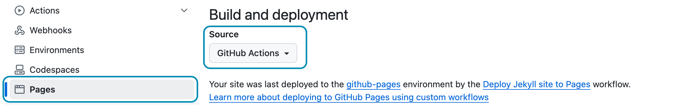

Эта глава была добавлена ​​в 2024 году с моими рекомендациями по развертыванию Hydejack на основе последних разработок в GitHub Pages и других изменений в мире развертывания статических сайтов.

Обратите внимание, что [Документация по развертыванию Jekyll][deploy] остается лучшим и наиболее актуальным ресурсом по всем вопросам развертывания Jekyll.
Эти документы представляют собой мои личные рецепты с некоторыми дополнительными шагами, которые в основном актуальны для **клиентов PRO**.

0. Этот неупорядоченный список начальных значений будет заменен на toc как неупорядоченный список
{:toc}

## Действия GitHub
Вы можете развертывать приложения на GitHub Pages из пользовательского действия GitHub. Это позволяет полностью настроить конвейер сборки, установить определенные версии для Ruby и Jekyll и использовать любой плагин Jekyll, который вы пожелаете.


Чтобы подключиться к конвейерам GitHub Actions, перейдите в настройки репозитория, найдите вкладку *Страницы* и убедитесь, что в поле *Источник* указан "GitHub Actions":


{:.border}

Убедитесь, что эти настройки включены для участия в конвейере GitHub Actions.

{:.figcaption}

Как и в случае с устаревшим конвейером GitHub Pages, развертывание запускается путем отправки коммитов в определенную ветку.
Чтобы настроить конвейер, создайте YAML-файл в `.github/workflows` в корне вашего репозитория со следующим содержимым:


~~~yml
# file: ".github/workflows/jekyll.yml"
# Sample workflow for building and deploying a Jekyll site to GitHub Pages
name: Deploy Jekyll site to Pages

on:
  # Runs on pushes targeting the default branch
  push:
    branches: [$default-branch] # You can change this to a specific branch (without the `$`)

  # Allows you to run this workflow manually from the Actions tab
  workflow_dispatch:

# Sets permissions of the GITHUB_TOKEN to allow deployment to GitHub Pages
permissions:
  contents: read
  pages: write
  id-token: write
# Разрешить только одно одновременное развертывание, пропуская запуски, поставленные в очередь между текущим и последним запущенным.

# Однако НЕ отменять текущие запуски, поскольку мы хотим, чтобы эти развертывания в производственной среде завершились.


concurrency:
  group: "pages"
  cancel-in-progress: false

jobs:
  # Build job
  build:
    runs-on: ubuntu-latest
    steps:
      - name: Checkout
        uses: actions/checkout@v4
        with:
          fetch-depth: 0  # Fetch whole history for jekyll-last-modified-at plugin
      - name: Setup Ruby
        uses: ruby/setup-ruby@8575951200e472d5f2d95c625da0c7bec8217c42 # v1.161.0
        with:
          ruby-version: '3.1' # Not needed with a .ruby-version file
          bundler-cache: true # runs 'bundle install' and caches installed gems automatically
          cache-version: 0 # Increment this number if you need to re-download cached gems
      - name: Setup Pages
        id: pages
        uses: actions/configure-pages@v5
      - name: Build with Jekyll
        # Outputs to the './_site' directory by default
        run: bundle exec jekyll build --baseurl "${{ steps.pages.outputs.base_path }}"
        env:
          JEKYLL_ENV: production
      - name: Upload artifact
        # Automatically uploads an artifact from the './_site' directory by default
        uses: actions/upload-pages-artifact@v3

  # Deployment job
  deploy:
    environment:
      name: github-pages
      url: ${{ steps.deployment.outputs.page_url }}
    runs-on: ubuntu-latest
    needs: build
    steps:
      - name: Deploy to GitHub Pages
        id: deployment
        uses: actions/deploy-pages@v4
~~~


Этот пример основан на репозитории [`actions/starter-workflows`](https://github.com/actions/starter-workflows/blob/main/pages/jekyll.yml)
с одним изменением, специфичным для Hydejack:

Шаг извлечения был изменен таким образом, чтобы получать всю историю репозитория.
Это позволяет плагину `jekyll-last-modified-at` генерировать точные даты на основе истории Git.

```yml
with:
  fetch-depth: 0  # Fetch whole history for jekyll-last-modified-at plugin
```

Этот GitHub Action работает с любой установкой Hydejack, которая также запущена на вашем локальном компьютере.

## Приватный репозиторий для PRO-клиентов
Если вы являетесь **PRO-клиентом** и следовали инструкциям во время установки темы в качестве зависимости Git, ваш конвейер развертывания должен быть авторизован для получения данных из приватного репозитория [`hydejack-pro`](https://github.com/hydecorp/hydejack-pro).

~~~ruby
# file: `Gemfile`
gem "jekyll-theme-hydejack", git: "https://github.com/hydecorp/hydejack-pro", tag: "pro/v9.2.1"
~~~

Убедитесь, что вы являетесь членом команды ["PRO Customers"](https://github.com/orgs/hydecorp/teams/pro-customers) на GitHub. Если вы указали свой ник на GitHub при оформлении заказа, вас должны были добавить автоматически; в противном случае вы можете запросить приглашение по адресу [mail@hydejack.com](mailto:mail@hydejack.com).

Примечание:

Для того чтобы Bundle мог получить доступ к приватному репозиторию, необходимо установить переменную окружения с именем __`BUNDLE_GITHUB__COM`__ в значение __`x-access-token:<GH_REPO_PAT>`__, где вы заменяете `<GH_REPO_PAT>` на
персональный токен доступа GitHub (PAT), имеющий разрешение на доступ к репозиторию.


Если вам подходит использование зависимостей Git, вы можете очистить свой репозиторий, удалив папку `#jekyll-theme-hydejack`.

{:.note}

Большинство CI-провайдеров имеют страницу настроек, позволяющую задавать переменные окружения. В случае с приведенным выше действием GitHub, переменная `BUNDLE_GITHUB__COM` необходима на этапе "Настройка Ruby". Измененный шаг выглядит следующим образом:


~~~yml
- name: Setup Ruby
  uses: ruby/setup-ruby@8575951200e472d5f2d95c625da0c7bec8217c42 # v1.161.0
  with:
    ruby-version: '3.1' # Not needed with a .ruby-version file
    bundler-cache: true # runs 'bundle install' and caches installed gems automatically
    cache-version: 0 # Increment this number if you need to re-download cached gems
  env: #!!
    BUNDLE_GITHUB__COM: x-access-token:${{ secrets.GH_REPO_PAT }} #!!
~~~



[deploy]: https://jekyllrb.com/docs/deployment-methods/
